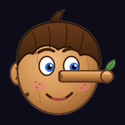
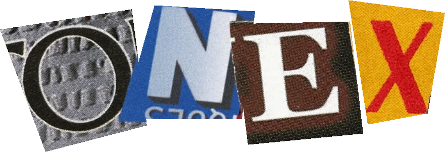

<div align="center">





**Ik bouw wat jij bedenkt.**
Servers, games en websites op maat.

[**onexbcs.github.io**](https://onexbcs.github.io)

</div>

---

## Over

Dit is de portfolio-website van **Xeno aka ONEX**. ONEX is gewoon Xeno achterstevoren.
De site draait rond Pinokkio, mijn bijnaam sinds ik klein ben: houten poppen, touwtjes, uitgeknipte letters en een neus die groeit.

## Wat zit erin

- **Home:** een houten marionet die naar je muis kijkt, liegt, danst en waarvan de neus groeit
- **Wie ben ik:** wie ik ben en waarom iedereen me Pinokkio noemt
- **Skills:** Lua, Python, HTML & CSS, JavaScript, SQL en C++
- **Laten maken:** custom websites, FiveM servers, Minecraft servers, Roblox games, Raspberry Pi projecten en meer
- **Socials:** al mijn kanalen op één plek
- **Contact:** knip je eigen brief in elkaar en verstuur hem via Gmail, je mail-app of Discord
- **NL / EN:** wissel met één klik tussen Nederlands en Engels
- **Geppetto op de menubalk** (alleen op computer): de oude houtsnijder uit het originele boek van Collodi, met zijn gele pruik, ligt op de navigatiebalk en rolt het touwtje van een mini-Pinokkio af als je naar beneden scrolt; Pinokkio zegt iets bij elke sectie
- **Krekel** (alleen op computer): zit links op de footer op een stapeltje oude boeken en speelt viool; onderaan de pagina zegt hij hallo
- **404-pagina:** 404 hangt aan touwtjes en Pinokkio kijkt verward rond (klik op een cijfer en het valt naar beneden)
- **Bezoekersteller:** telt unieke bezoekers via GoatCounter, zonder cookies en zonder IP-adressen op te slaan

## Gebouwd met

- HTML, CSS en JavaScript, zonder frameworks
- SVG voor de marionet en de icoontjes
- Google Fonts
- GitHub Pages om de site online te zetten

## Structuur

```
index.html                 de pagina
404.html                   pagina voor links die niet bestaan
favicon.ico                tab-icoontje
assets/
  css/style.css            alle opmaak
  js/i18n.js               vertalingen Nederlands ⇄ Engels
  js/main.js               alle interactie (marionet, skills, contactbrief)
  js/companion.js          houtsnijder + mini-Pinokkio die je volgt tijdens het scrollen
  js/cricket.js            de vioolspelende krekel in de footer
  images/                  ONEX-letters, logo en favicons
```

## Contact

Iets laten maken of een vraag? Gebruik het contactformulier op de site of stuur een DM op Discord.

---

<div align="center">

© 2026 Xeno aka ONEX · geen touwtjes aan vast

</div>
